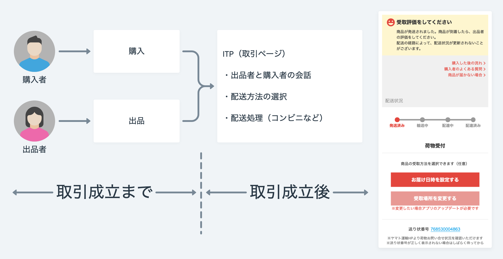

## 今日話すこと

1. 自己紹介
2. **ITPチームについて** ← イマココ
3. ITPのコードベース上での工夫
4. ITPの開発体制に関する工夫
5. まとめ

---

## Web Frontend teams in Mercari

---

## WebアプリケーションとしてのITP

- **React / Redux / Redux-Saga による SPA**
- WebView上でのみ表示される特殊なアプリケーション
  - 開発はシミュレータではなくPCのブラウザで

（最終確認はシミュレータだが、シミュレータは操作しにくくデバッグしにくいので使わない）

---

## ITPの主な機能

- 購入者と出品者がテキストで会話できる 🗣️
- 出品者が出品方法を選択して発送できる 📦
- ヤマトや日本郵政のAPIとのやり取りが多い 🐈 💖 🧸

---

## ITPチームの最近の活動

- らくらくメルカリ便で「受け取り場所の変更」ができるようになった
- ゆうゆうメルカリ便で「ゆうパケットプラス」が選択できるようになった

ゆうパケットプラスの提供開始！そこで、何が「#ゆうパケットプラスに入った」のか
をやってみた #メルカリな日々 | メルカン | https://mercan.mercari.com/articles/17554/
