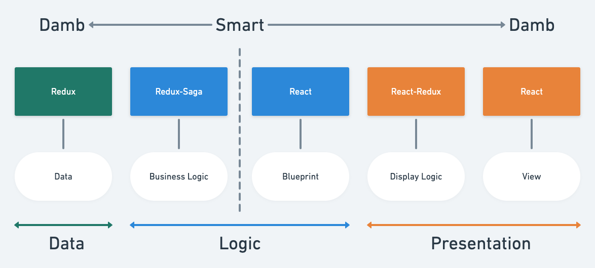

import { SideLayer } from "./components/SideLayer";

# 今日のトピック

---

# 開発速度と品質を両立しながら開発を行うためにITPチームが何を行っているか

---

## 今日のまとめ

- 巨大なビジネスロジックの制御方法（何を作っているか）
- スクラムの実践方法（どうやって作っているか）

---

## ITPは単一のアプリケーションだが巨大で複雑なビジネスロジックを持っている

ITP（取引画面）は次の条件で振る舞いを変える

- **購入者** か **出品者**
- **取引状態** (WaitShipping / WaitReview / Done, ...)
- **発送方法** (らくらくメルカリ便, ゆうゆうメルカリ便, 大型らくらくメルカリ便, ...)
- **商品カテゴリ** (あんしんスマホサポート, あんしん自動車保証, ...)

---

## ITP（取引画面）の例


<!-- 取引画面の遷移図も書きたい -->

---

## ポイント :bulb:

- ビジネスロジックは画面ごとに異なる
- 共有できるコンポーネントが多くある
- ☞ ビジネスロジックとUIがきれいに分割できるかどうかが重要

<span className="vs-16"></span>

## ビジネスロジックとUIがきれいに分割できると

<span className="vs-16"></span>

- 再利用がしやすい （**開発速度の向上**）
- テストしやすく変更にも強くなる （**品質の向上**）

---

## 具体的にはどうやって分ける？

データ層・ロジック層・プレゼンテーション層などのレイヤーに分離

---



---

## Presentation Layer (React)

<!--
  どう見えるか
  - formatting
  - styling
  - accessibility
-->

- マークアップやスタイリング
- 責務が明確なのでデザインシステムに移行しやすい（移行したとは言っていない）

```js:
const CommentBoxTypeOne: React.FC<Props> = ({
  messages,
  handleMessageChange,
  handleSubmit,
  shouldDisableSendButton,
}) => (
  <div class="block">
    <textarea
      value={message}
      onChange={handleMessageChange}
    />
    {!shouldDisableSendButton && <PrimaryButton onClick={handleSubmit} />}
  </div>
);
```

---

## Presentaion Layer (React-Redux)

<!--
「何が見えるか」を定義する層
- select data
- select component
- connect data to component
-->

- コンポーネント・データを**選択し紐付ける**

```js:
const CommentBox: React.FC<Props> = ({
  shouldDisableSentButton,
  messages,
}) => {
  if (someBranchingLogic) {
    return <CommentBoxTypeOne />;
  }
  return <CommentBoxTypeTwo />;
}

const mapStateToProps = ({ transaction }: Store) => ({
  // ...some display logic
  shouldDisableSentButton,
  messages: someCalculation(transaction.messages),
});;

const mapDispatchToProps = () => ({
  handleMessageChange: updateMessage
});

export const SmartCommentBox = connect(
  mapStateToProps,
  mapDispatchToProps,
)(CommentBox);
```

---

## Business Logic Layer (Redux-Saga)

- **振る舞い**を定義する層

```
例: メッセージを送信するときのビジネスロジック

1. コメントボックスに入力されたメッセージを取り出す
2. 本当に送信するかの確認のためにダイアログを表示する
3. 確認ボタンが押されたらメッセージをAPIに送信する
4. APIにエラーが発生したらエラーメッセージを表示する
5. 送信に成功したらメッセージのリストを更新する
```

---

## Business Logic layer (Redux-Saga)

- Sagaを起動

```js
function createRootSaga(api: APIClient) {
  return function *rootSaga() {
    yield fork(function*() {
      while(true) {
        const action = yield take(POST_CHAT_MESSAGE);
        yield call(postMessageSaga, apiClient, action);
      }
    });
  }
}
```

---

## Business Logic layer (Redux-Saga)

- Saga本体

```js
export function* postMessageSaga(api: APIClient, action: ReduxAction<{ message: string }>) {
  // 1. コメントボックスに入力されたメッセージを取り出す
  const { message } = action.payload;

  // 2. 本当に送信するかの確認のためにダイアログを表示する
  const confirmParams: ConfirmParams = {
    message: "本当にメッセージを送信しますか？",
    confirmText: "はい",
    dismissText: "いいえ"
  };
  if (!(yield call(nativeConfirm, confirmParams))) {
    return;
  }

  const evidenceId = yield select(transactionEvidenceSelector);

  try {
    // 3. 確認ボタンが押されたらメッセージをAPIに送信する
    yield call([api, api.postTransactionmessage], { evidenceId, message });
  } catch(e) {
    // 4. APIにエラーが発生したらエラーメッセージを表示する
    yield call(nativeAlert, e.message);
    return;
  }

  // 5. 送信に成功したらメッセージのリストを更新する
  yield call(fetchTransactionMessages, api, { evidenceId });
}
```

---

## Data Layer (Redux Store)

- `Reducer`にロジックを書くことは可能
- 絶対にロジックを持たせない強い意思が重要

```js:
function comment(state: string = "", action: ReduxAction<Comment>) {
  switch (action.type) {
    case INPUT_COMMENT:
      return action.payload;
    case CLEAR_COMMENT:
      return "";
    default:
      return state;
  }
}
```

---

- 以上がフロントエンドアプリケーションの見通しを良くする設計論
- とはいえどこに何を書くべきか混乱することもある

---

## ディレクトリベースでレイヤを分割して分割の間違いが起こりにくいようにしている

```
src
├── common
│   └── components → Common Presentation Layer (Damb Components)
│       ├── Button.tsx
│       ├── Panel.tsx
│       └── Row.tsx
└── transactions → 取引方法ごとにディレクトリを分割
    ├── car
    ├── oogata
    └── rakuraku
        ├── Buyer.tsx
        ├── Seller.tsx
        ├── components → Specific Presentation Layer (Damb Components)
        │   ├── ProductDetail.tsx
        │   └── TransactionInfo.tsx
        ├── containers → Presentation Layer (Smart Containers)
        │   ├── Done.tsx
        │   ├── WaitReview.tsx
        │   └── WaitShipping.tsx
        └── stores
            ├── reducers.ts → Data Layer
            └── sagas.ts → Logic Layer
```
